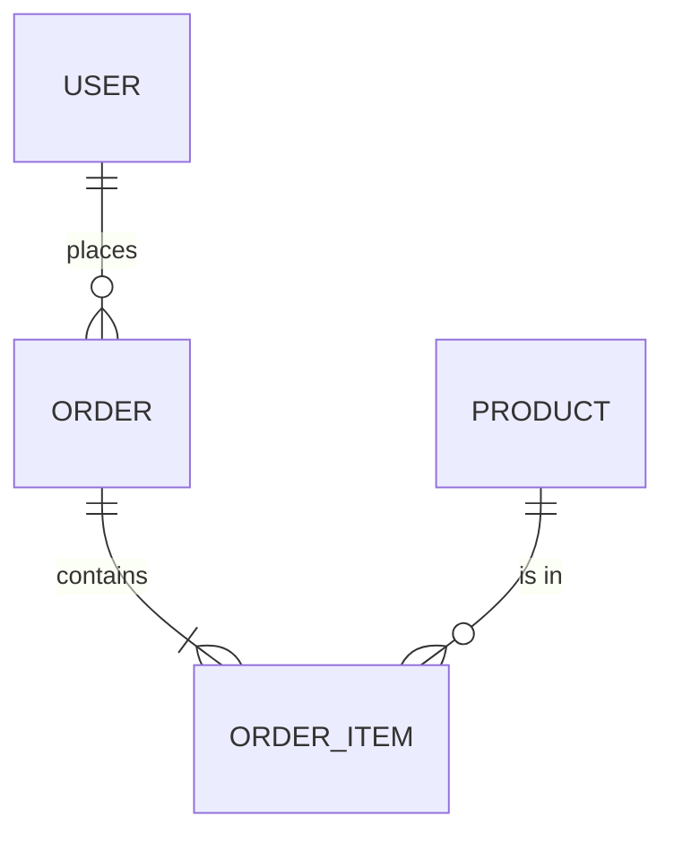
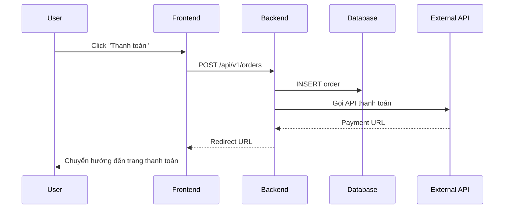

# 📋 WORKFLOW: CHỐT ĐẶC TẢ KỸ THUẬT (Specs — API & DB)

## Khi nào dùng?
Mỗi khi bạn cần chốt kiến trúc dữ liệu, API endpoints, hoặc thiết kế hệ thống trước khi viết code. `NO SPEC ➔ NO CODE`.

---

## BƯỚC 1: MÔ TẢ BÀI TOÁN (Bạn làm)

Nói với AI theo format này:
```
"Tôi cần thiết kế hệ thống cho [tên tính năng].
Dữ liệu chính gồm: [liệt kê các loại dữ liệu].
Người dùng sẽ: [mô tả hành động chính].
Hệ thống cần tích hợp với: [các service/API bên ngoài nếu có].
Ví dụ tham khảo: [sản phẩm tương tự]."
```

**Ví dụ tốt:**
> "Tôi cần thiết kế hệ thống quản lý đơn hàng.
> Dữ liệu chính gồm: sản phẩm, đơn hàng, khách hàng, thanh toán.
> Người dùng sẽ: tạo đơn, thanh toán online, theo dõi trạng thái.
> Hệ thống cần tích hợp với: VNPay, MoMo, GHN (giao hàng).
> Ví dụ tham khảo: Shopee, Tiki."

**Ví dụ xấu:**
> "Làm CRUD đơn hàng" ← Quá chung chung, thiếu bối cảnh

---

## BƯỚC 2: AI THIẾT KẾ DATABASE SCHEMA (AI làm, bạn review)

AI sẽ tự động tạo sơ đồ cơ sở dữ liệu đầy đủ:

### 2.1 Entity Relationship Diagram (ERD)

Vẽ sơ đồ quan hệ giữa các bảng bằng Mermaid:


### 2.2 Chi tiết từng Bảng (Table Definition)

Mỗi bảng phải ghi rõ theo format:

```
📦 Bảng: [tên_bảng]
├── Mục đích: [Bảng này lưu gì?]
├── Cột (Columns):
│   ├── id          — UUID, PK, NOT NULL
│   ├── name        — VARCHAR(255), NOT NULL
│   ├── email       — VARCHAR(255), UNIQUE, NOT NULL
│   ├── status      — ENUM('active','inactive'), DEFAULT 'active'
│   ├── created_at  — TIMESTAMP, DEFAULT NOW()
│   └── updated_at  — TIMESTAMP, ON UPDATE NOW()
├── Index:
│   ├── idx_email   — UNIQUE(email)
│   └── idx_status  — INDEX(status)
├── Foreign Keys:
│   └── fk_user_id  — REFERENCES users(id) ON DELETE CASCADE
└── Ghi chú: [Lưu ý đặc biệt]
```

### 2.3 Checklist Database Design

- [ ] Mỗi bảng có Primary Key (PK)?
- [ ] Các mối quan hệ (1-1, 1-N, N-N) đã đúng?
- [ ] Đã có Index cho các cột thường xuyên truy vấn (WHERE, JOIN)?
- [ ] Kiểu dữ liệu phù hợp (VARCHAR vs TEXT, INT vs BIGINT)?
- [ ] Có Soft Delete (deleted_at) hay Hard Delete?
- [ ] Timestamps (created_at, updated_at) đầy đủ?
- [ ] ENUM values đã liệt kê hết?
- [ ] Có cần partitioning cho bảng lớn không?

**Bạn cần review:**
- Tên bảng/cột có dễ hiểu không?
- Có thiếu bảng nào không?
- Quan hệ giữa các bảng có đúng logic nghiệp vụ không?

---

## BƯỚC 3: AI THIẾT KẾ API ENDPOINTS (AI làm, bạn review)

### 3.1 Tổng quan API Map

Liệt kê toàn bộ endpoints theo nhóm:

```
🌐 API MAP: [Tên module]
├── 🔓 Auth
│   ├── POST   /api/v1/auth/register
│   ├── POST   /api/v1/auth/login
│   ├── POST   /api/v1/auth/logout
│   └── POST   /api/v1/auth/refresh-token
├── 👤 Users
│   ├── GET    /api/v1/users/me
│   ├── PATCH  /api/v1/users/me
│   └── DELETE /api/v1/users/me
├── 📦 Products
│   ├── GET    /api/v1/products          (List + Filter + Pagination)
│   ├── GET    /api/v1/products/:id      (Detail)
│   ├── POST   /api/v1/products          (Create) [Admin]
│   ├── PATCH  /api/v1/products/:id      (Update) [Admin]
│   └── DELETE /api/v1/products/:id      (Delete) [Admin]
└── 🛒 Orders
    ├── POST   /api/v1/orders            (Create)
    ├── GET    /api/v1/orders            (List my orders)
    └── GET    /api/v1/orders/:id        (Detail)
```

### 3.2 Chi tiết từng Endpoint

Mỗi endpoint phải mô tả đầy đủ theo format:

```
━━━━━━━━━━━━━━━━━━━━━━━━━━━━━━━━━━━━━━
📌 POST /api/v1/auth/register
━━━━━━━━━━━━━━━━━━━━━━━━━━━━━━━━━━━━━━

📝 Mô tả: Đăng ký tài khoản mới
🔒 Auth: Không yêu cầu (Public)
⏱️ Rate Limit: 5 requests/phút

📥 Request:
  Headers:
    Content-Type: application/json

  Body:
    {
      "email": "user@example.com",       // string, required, format: email
      "password": "MyP@ss123",           // string, required, min: 8 ký tự
      "full_name": "Nguyễn Văn A",       // string, required, max: 100
      "phone": "0901234567"              // string, optional, format: VN phone
    }

📤 Response — Success (201 Created):
    {
      "success": true,
      "data": {
        "id": "uuid-xxx",
        "email": "user@example.com",
        "full_name": "Nguyễn Văn A",
        "created_at": "2024-01-15T10:30:00Z"
      },
      "message": "Đăng ký thành công"
    }

📤 Response — Error (400 Bad Request):
    {
      "success": false,
      "error": {
        "code": "VALIDATION_ERROR",
        "message": "Email đã tồn tại",
        "details": [
          { "field": "email", "message": "Email này đã được sử dụng" }
        ]
      }
    }

📤 Response — Error (429 Too Many Requests):
    {
      "success": false,
      "error": {
        "code": "RATE_LIMIT_EXCEEDED",
        "message": "Bạn đã gửi quá nhiều yêu cầu. Vui lòng thử lại sau 60 giây."
      }
    }

🧪 Test Cases:
  ✅ Đăng ký thành công với dữ liệu hợp lệ
  ❌ Email đã tồn tại → 400
  ❌ Password < 8 ký tự → 400
  ❌ Thiếu trường required → 400
  ❌ Gửi quá 5 lần/phút → 429
━━━━━━━━━━━━━━━━━━━━━━━━━━━━━━━━━━━━━━
```

### 3.3 Quy chuẩn API chung

| Tiêu chí | Quy tắc |
|---|---|
| **URL Format** | `/api/v{version}/{resource}` — lowercase, plural nouns |
| **HTTP Methods** | GET (đọc), POST (tạo), PATCH (sửa một phần), PUT (thay thế), DELETE (xóa) |
| **Status Codes** | 200 OK, 201 Created, 204 No Content, 400 Bad Request, 401 Unauthorized, 403 Forbidden, 404 Not Found, 422 Unprocessable, 429 Rate Limit, 500 Server Error |
| **Pagination** | `?page=1&limit=20` → Response kèm `meta: { total, page, limit, totalPages }` |
| **Filtering** | `?status=active&sort=-created_at` (dấu `-` = DESC) |
| **Search** | `?q=keyword` |
| **Response Format** | `{ success, data, message, error, meta }` |
| **Date Format** | ISO 8601: `2024-01-15T10:30:00Z` |
| **Auth** | Bearer Token trong Header: `Authorization: Bearer <token>` |

### 3.4 Checklist API Design

- [ ] URL RESTful đúng chuẩn (plural nouns, không dùng verbs)?
- [ ] Mỗi endpoint có mô tả Auth requirement?
- [ ] Request validation rõ ràng (required, type, min/max, format)?
- [ ] Response format thống nhất (success + error)?
- [ ] HTTP Status code đúng ngữ nghĩa?
- [ ] Có pagination cho danh sách?
- [ ] Có rate limiting?
- [ ] Error codes nhất quán và dễ debug?
- [ ] Có versioning (v1, v2)?

---

## BƯỚC 4: AI THIẾT KẾ LUỒNG XỬ LÝ (AI làm, bạn review)

### 4.1 Sequence Diagrams cho các luồng phức tạp

Vẽ bằng Mermaid cho các luồng quan trọng:



### 4.2 State Machine (cho các entity có trạng thái)

```
📊 Trạng thái Đơn hàng:

  [PENDING] ──(thanh toán)──> [PAID]
  [PAID] ──(xác nhận)──> [CONFIRMED]
  [CONFIRMED] ──(giao hàng)──> [SHIPPING]
  [SHIPPING] ──(giao xong)──> [DELIVERED]
  [DELIVERED] ──(hoàn thành)──> [COMPLETED]

  Ngoại lệ:
  [PENDING] ──(hết hạn 30p)──> [CANCELLED]
  [PAID] ──(hoàn tiền)──> [REFUNDED]
  [SHIPPING] ──(thất bại)──> [FAILED]
```

---

## BƯỚC 5: AI THIẾT KẾ ERROR HANDLING & SECURITY (AI làm)

### 5.1 Bảng mã lỗi (Error Codes)

| Code | HTTP Status | Mô tả | Ví dụ |
|---|---|---|---|
| `VALIDATION_ERROR` | 400 | Dữ liệu không hợp lệ | Email sai format |
| `UNAUTHORIZED` | 401 | Chưa đăng nhập | Token hết hạn |
| `FORBIDDEN` | 403 | Không có quyền | User truy cập trang Admin |
| `NOT_FOUND` | 404 | Không tìm thấy | Product ID không tồn tại |
| `CONFLICT` | 409 | Xung đột dữ liệu | Email đã tồn tại |
| `RATE_LIMIT_EXCEEDED` | 429 | Quá nhiều request | Spam API |
| `INTERNAL_ERROR` | 500 | Lỗi server | Bug chưa handle |

### 5.2 Checklist Bảo mật

- [ ] Input validation ở cả Frontend và Backend?
- [ ] SQL Injection prevention (ORM/Parameterized queries)?
- [ ] XSS prevention (sanitize output)?
- [ ] CSRF protection?
- [ ] Rate limiting cho các endpoint nhạy cảm (login, register, forgot-password)?
- [ ] Password hashing (bcrypt/argon2)?
- [ ] Sensitive data không trả về trong response (password, secret keys)?
- [ ] CORS cấu hình đúng?
- [ ] HTTPS bắt buộc?
- [ ] Logging không chứa dữ liệu nhạy cảm?

---

## BƯỚC 6: AI THIẾT KẾ TÍCH HỢP BÊN NGOÀI (AI làm, nếu có)

### 6.1 Danh sách tích hợp

| Service | Mục đích | API Docs | API Key cần | Ghi chú |
|---|---|---|---|---|
| VNPay | Thanh toán | [link] | Có | Cần đăng ký merchant |
| Firebase | Push notification | [link] | Có | Free tier đủ dùng |
| Cloudinary | Upload ảnh | [link] | Có | 25GB free |
| SendGrid | Gửi email | [link] | Có | 100 email/ngày free |

### 6.2 Chi tiết từng tích hợp

Mỗi service bên ngoài cần mô tả:
- Luồng tích hợp (Integration Flow)
- Xử lý khi service lỗi (Fallback Strategy)
- Webhook/Callback URL (nếu có)
- Môi trường test (Sandbox) có không?

---

## BƯỚC 7: XÁC NHẬN VÀ LƯU TRỮ (Bạn làm)

### 7.1 Review cuối cùng

Nếu đồng ý: **"OK, specs đã ổn. Chuyển sang planning."**
Nếu cần sửa: **"Sửa lại: [điểm cần thay đổi]"**
Nếu cần bổ sung: **"Thêm endpoint [X] cho chức năng [Y]"**

### 7.2 Lưu trữ

AI sẽ lưu toàn bộ Spec vào:
`.obsidian-vault/07-Superpowers/Specs/YYYY-MM-DD-<topic>-design.md`

---

## CHECKLIST TỔNG THỂ TRƯỚC KHI CHUYỂN SANG PLANNING

- [ ] Database schema đã hoàn chỉnh (ERD + bảng chi tiết)?
- [ ] Tất cả API endpoints đã liệt kê?
- [ ] Mỗi endpoint có request/response mẫu?
- [ ] Error handling & mã lỗi thống nhất?
- [ ] Security checklist đã xong?
- [ ] Luồng xử lý phức tạp đã có Sequence Diagram?
- [ ] Tích hợp bên ngoài đã liệt kê đầy đủ?
- [ ] User/Tech Lead đã review và đồng ý?

---

## RULES CỦA WORKFLOW NÀY

1. **Không skip Database Design** — DB sai thì API sai, API sai thì Frontend sai, toàn bộ sụp đổ.
2. **Mỗi endpoint phải có ví dụ Response** — Không được chỉ ghi tên endpoint rồi bỏ qua.
3. **Error cases quan trọng hơn Happy path** — Luôn nghĩ "Nếu lỗi thì sao?" trước khi nghĩ "Nếu thành công thì sao?"
4. **Ghi lại quyết định thiết kế** — Tại sao chọn UUID thay vì Auto Increment? Tại sao dùng PATCH thay vì PUT?
5. **Spec là nguồn sự thật duy nhất (Single Source of Truth)** — Code phải tuân theo Spec, không phải ngược lại.
