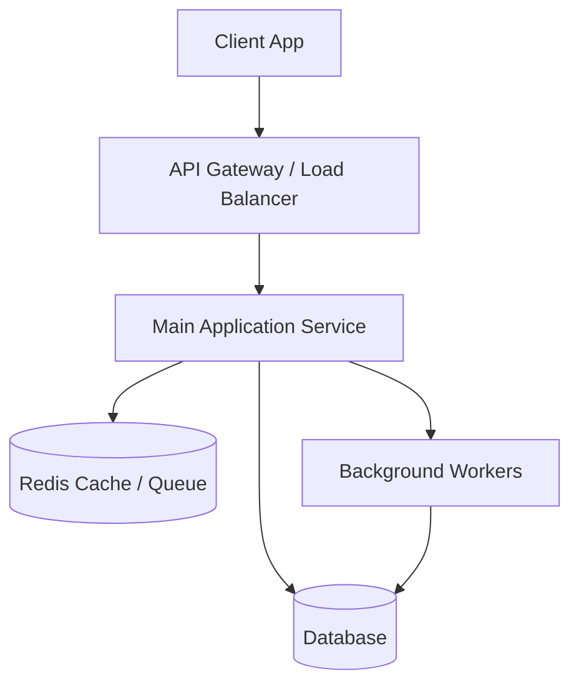

# System Architecture

## 1. High-Level Diagram
<!-- TODO: Vẽ diagram kiến trúc hệ thống (Mermaid hoặc hình ảnh) -->

## 2. Component Directory

| Component | Responsibility | Tech Stack |
|-----------|----------------|------------|
| **Frontend** | Giao diện người dùng | |
| **Backend** | Xử lý logic nghiệp vụ chính | |
| **Database** | Lưu trữ dữ liệu quan hệ | |
| **Cache/Queue** | Caching & Hàng đợi tác vụ | |
| **Storage** | Lưu trữ file tĩnh/media | |

## 3. Data Flow
<!-- Mô tả cách dữ liệu đi qua hệ thống -->
1. Client gửi request qua Gateway.
2. Gateway chuyển tiếp đến Backend.
3. Backend xử lý nghiệp vụ, đọc/ghi DB và Cache.
4. Trả kết quả về cho Client.
5. (Nếu có tác vụ nặng) Đưa vào Queue để Background Worker xử lý bất đồng bộ.
