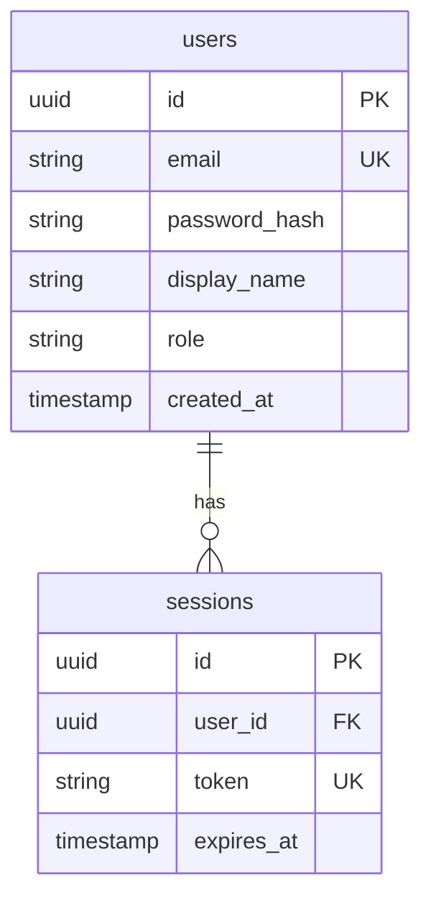

# Entity Relationship Diagram (ERD)

## 1. Visual ERD
<!-- Sử dụng Mermaid syntax để biểu diễn các thực thể và quan hệ -->

## 2. Table List

| Table Name | Description | Key Relationships |
|------------|-------------|-------------------|
| `users` | Lưu thông tin người dùng | 1:N với `sessions` |
| `sessions` | Quản lý phiên đăng nhập | N:1 với `users` |

## 3. Related Documents
- [[Database-Design]]
