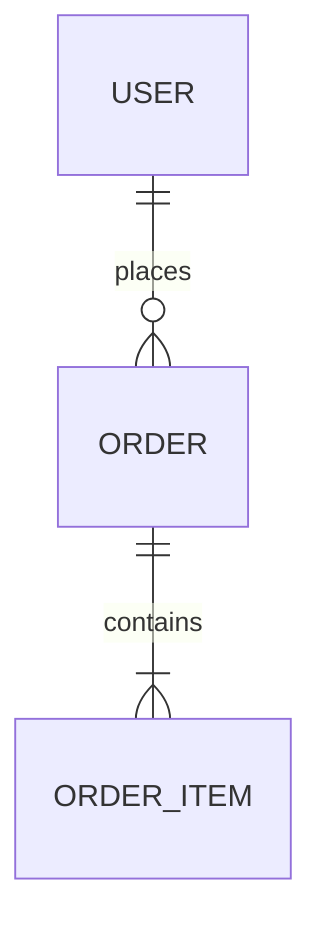
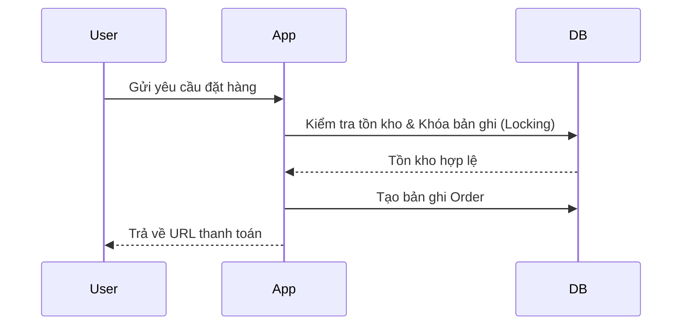

# 📐 WORKFLOW: THIẾT KẾ ĐẶC TẢ KỸ THUẬT (Specs - API & DB & Ideation)

## Khi nào dùng?
- Mỗi khi bạn bắt đầu phát triển một tính năng mới hoặc thay đổi kiến trúc hệ thống hiện có.
- Giai đoạn này là cầu nối từ kết quả nghiên cứu kỹ thuật (`research.md`) hoặc yêu cầu ban đầu của người dùng, chuyển hóa thành đặc tả kỹ thuật cụ thể trước khi lập kế hoạch code.
- **Quy tắc cốt lõi:** `NO SPEC ➔ NO CODE`.
- **Slash command:** `/specs`

---

## ⚔️ MỤC TIÊU

> **Lên ý tưởng thiết kế, so sánh và lựa chọn phương án tối ưu nhất, đặc tả chi tiết Cơ sở dữ liệu (DB Schema), giao diện lập trình (API Endpoints), luồng xử lý (Flows), từ đó đẩy toàn bộ thiết kế thành các đầu việc cụ thể để lập Kế hoạch thực thi (Plan).**

---

## 🚫 ĐIỀU KIỆN THẤT BẠI (REJECT lập tức)

1. ❌ Nhảy ngay vào code hoặc viết thiết kế chi tiết mà không có pha lên ý tưởng và so sánh các giải pháp.
2. ❌ Không chọn phương án tối ưu dựa trên lập luận khoa học/kỹ thuật.
3. ❌ DB schema thiếu các ràng buộc (Constraints), khóa ngoại (FK), hoặc các chỉ mục cần thiết (Indexes).
4. ❌ API Endpoints không có ví dụ cụ thể về Response thành công và thất bại kèm HTTP Status Codes.
5. ❌ Thiết kế xong nhưng không chuyển hóa thành danh sách task cụ thể để lập Plan.

---

## 🛠️ CÁC BƯỚC THỰC HIỆN

### BƯỚC 1: MÔ TẢ Ý TƯỞNG & BỐI CẢNH (Initial Idea & Context)

Người dùng hoặc AI đưa ra bối cảnh ban đầu:
- **Tên tính năng:** [Tên tính năng]
- **Yêu cầu cốt lõi:** Người dùng sẽ thực hiện hành động gì và nhận được kết quả gì?
- **Ví dụ tham khảo:** Các sản phẩm tương tự đang hoạt động trên thị trường.

---

### BƯỚC 2: PHÁT TRIỂN Ý TƯỞNG & CHỌN PHƯƠNG ÁN TỐI ƯU (Ideation & Selection)

> ⚠️ **LUẬT THÉP:** Trước khi chốt thiết kế, hãy phát triển và so sánh các ý tưởng/phương án triển khai khác nhau để tìm ra giải pháp tối ưu nhất.

#### 2.1 Brainstorm các ý tưởng thiết kế (UI/UX, Kiến trúc, Thuật toán):
- **Ý tưởng 1:** [Mô tả cách tiếp cận 1] - ví dụ: Xử lý đồng bộ, lưu trữ trực tiếp DB.
- **Ý tưởng 2:** [Mô tả cách tiếp cận 2] - ví dụ: Sử dụng hàng đợi (Queue) xử lý bất đồng bộ, gửi notify qua webhook.
- **Ý tưởng 3:** [Mô tả cách tiếp cận 3] - ví dụ: Lưu tạm local storage ở client, đồng bộ định kỳ.

#### 2.2 Đánh giá và Lựa chọn giải pháp tối ưu:
Đánh giá các ý tưởng dựa trên các tiêu chí: tính khả thi, độ trễ, trải nghiệm người dùng (UX), và thời gian phát triển.

```
💡 ĐÁNH GIÁ Ý TƯỞNG & LỰA CHỌN PHƯƠNG ÁN
━━━━━━━━━━━━━━━━━━━━━━━━━━━━━━━━━━━━━━
• Ý tưởng 1: Phù hợp MVP, phát triển nhanh nhưng có nguy cơ nghẽn nếu request cao.
• Ý tưởng 2: Chịu tải tốt, UX mượt mà (không bắt user đợi), nhưng tốn công setup queue.
• Ý tưởng 3: Giảm tải server tốt nhất nhưng rủi ro mất dữ liệu nếu user xóa cache.

🎯 Lựa chọn cuối cùng: [Ý tưởng 2]
• Lý do chọn: Đảm bảo khả năng mở rộng lâu dài và trải nghiệm người dùng mượt mà, xứng đáng với chi phí phát triển tăng thêm 15%.
━━━━━━━━━━━━━━━━━━━━━━━━━━━━━━━━━━━━━━
```

---

### BƯỚC 3: THIẾT KẾ DATABASE SCHEMA CHI TIẾT (Database Design)

Chỉ thực hiện cho phương án đã được lựa chọn ở Bước 2.

#### 3.1 Entity Relationship Diagram (ERD):
Vẽ sơ đồ quan hệ thực thể bằng Mermaid:


#### 3.2 Định nghĩa chi tiết các Bảng:
Mỗi bảng cần xác định rõ kiểu dữ liệu, khóa chính (PK), khóa ngoại (FK), ràng buộc (Constraints), và chỉ mục (Indexes).

```
📦 Bảng: orders
├── Mục đích: Lưu trữ thông tin đơn đặt hàng của người dùng.
├── Các cột:
│   ├── id          — UUID, PK, DEFAULT gen_random_uuid()
│   ├── user_id     — UUID, FK -> users(id) ON DELETE RESTRICT, NOT NULL
│   ├── total_cents — INTEGER, NOT NULL (Lưu đơn vị cents để tránh sai số float)
│   ├── status      — ENUM('pending', 'paid', 'failed'), DEFAULT 'pending'
│   └── created_at  — TIMESTAMP, DEFAULT NOW()
├── Chỉ mục (Indexes):
│   ├── idx_orders_user_id   — INDEX(user_id)
│   └── idx_orders_status    — INDEX(status)
 Ghi chú: Sử dụng soft delete bằng cách thêm trường deleted_at nếu cần thiết.
```

---

### BƯỚC 4: THIẾT KẾ API ENDPOINTS CHI TIẾT (API Design)

#### 4.1 Danh sách API Endpoints:
```
🌐 API MAP: [Tên Module]
├── POST   /api/v1/orders        (Tạo đơn hàng mới)
└── GET    /api/v1/orders/:id    (Lấy chi tiết đơn hàng)
```

#### 4.2 Chi tiết từng API Endpoint:
Mỗi API phải mô tả rõ: URL, Method, Request Headers/Body, Response mẫu cho cả trường hợp Thành công (2xx) và Lỗi (4xx, 5xx).

```
━━━━━━━━━━━━━━━━━━━━━━━━━━━━━━━━━━━━━━
📌 POST /api/v1/orders
━━━━━━━━━━━━━━━━━━━━━━━━━━━━━━━━━━━━━━
📝 Mô tả: Tạo đơn hàng mới từ giỏ hàng.
🔒 Quyền truy cập: Đã đăng nhập (User).
📥 Request Body:
    {
      "items": [
        { "product_id": "uuid-111", "quantity": 2 }
      ]
    }
📤 Response - Success (201 Created):
    {
      "success": true,
      "data": {
        "order_id": "uuid-orders-999",
        "status": "pending",
        "total_cents": 5000
      }
    }
📤 Response - Error (400 Bad Request):
    {
      "success": false,
      "error": {
        "code": "OUT_OF_STOCK",
        "message": "Sản phẩm uuid-111 đã hết hàng."
      }
    }
━━━━━━━━━━━━━━━━━━━━━━━━━━━━━━━━━━━━━━
```

---

### BƯỚC 5: THIẾT KẾ LUỒNG XỬ LÝ (Flows & State Machine)

Vẽ sơ đồ trình tự (Sequence Diagram) để mô tả luồng giao tiếp giữa các thành phần hoặc máy trạng thái (State Machine) đối với các thực thể có nhiều trạng thái phức tạp.



---

### BƯỚC 6: LIÊN KẾT & ĐẨY THIẾT KẾ SANG PLAN (Mapping to Plan)

> **Mục tiêu:** Chuyển hóa toàn bộ tài liệu Spec này thành các đầu việc kỹ thuật cụ thể để làm đầu vào cho quy trình Lập kế hoạch (`planning.md`).

AI sẽ phân rã Spec đã duyệt thành danh sách việc cần làm (Checklist Tasks) chi tiết:

```
📋 SPEC TO PLAN CHECKLIST
━━━━━━━━━━━━━━━━━━━━━━━━━━━━━━━━━━━━━━
[ ] DB: Tạo migration cho bảng orders với các indexes tương ứng.
[ ] DB: Tạo seed data cho các sản phẩm để test.
[ ] API: Viết test case (RED) cho endpoint POST /api/v1/orders.
[ ] API: Viết logic xử lý (GREEN) kiểm tra tồn kho và tạo order.
[ ] API: Viết test case (RED) cho endpoint GET /api/v1/orders/:id.
[ ] API: Viết logic xử lý (GREEN) trả về thông tin chi tiết order.
[ ] Integration: Test tích hợp luồng đặt hàng hoàn chỉnh.
━━━━━━━━━━━━━━━━━━━━━━━━━━━━━━━━━━━━━━
```

Lưu toàn bộ tài liệu Spec vào: `.obsidian-vault/07-Superpowers/Specs/YYYY-MM-DD-<topic>-design.md`

---

## CHECKLIST TỔNG THỂ TRƯỚC KHI LẬP PLAN

```
- [ ] Ý tưởng thiết kế đã được brainstorm và so sánh các phương án kỹ thuật?
- [ ] Lý do chọn phương án tối ưu nhất có đầy đủ luận điểm thuyết phục?
- [ ] Sơ đồ ERD và định nghĩa các bảng dữ liệu đã có khóa ngoại & index?
- [ ] Các API Endpoints đã có đầy đủ request/response mẫu (thành công + lỗi)?
- [ ] Luồng xử lý phức tạp đã được vẽ Sequence Diagram hoặc State Machine?
- [ ] Thiết kế đã được phân rã thành danh sách Task để chuẩn bị lập Plan?
- [ ] File Spec đã được lưu trữ đúng vị trí quy định?
```

---

## RULES CỦA WORKFLOW NÀY

1. **No Spec, No Code** — Đây là luật thép bất biến. Tuyệt đối không viết code khi chưa chốt Spec.
2. **Optimize Before Detailing** — Phải tìm ra phương án tối ưu nhất ở Bước 2 trước khi đi sâu vào thiết kế chi tiết bảng và API ở các bước sau. Tránh lãng phí thời gian thiết kế chi tiết cho phương án bị loại bỏ.
3. **Handle Edge Cases Early** — Luôn thiết kế các mã lỗi (Error codes) và trường hợp ngoại lệ ngay trong Spec. Đừng đợi đến lúc code mới nghĩ cách xử lý lỗi.
4. **Plan Alignment** — Danh sách task ở Bước 6 phải khớp 100% với các đầu việc sẽ được khai báo trong file Plan của quy trình `/planning`.
